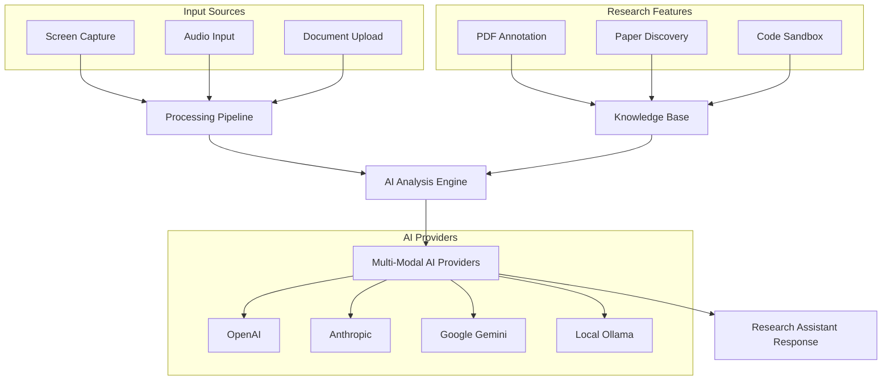

````markdown
<p align="center">
  <h1 align="center">🔬 RANI - Research Assistant for Novel Inquiry</h1>
  <p align="center">
    <em>An AI-powered research copilot designed to support researchers in learning, annotating, exploring, and experimenting with new ideas through real-time dialogue, paper analysis, and hands-on practice.</em>
  </p>
</p>

<p align="center">
  <a href="https://github.com/jasjeevsingh/rani/issues"></a>
  <a href="https://github.com/jasjeevsingh/rani/stargazers"></a>
  <a href="https://github.com/jasjeevsingh/rani/blob/main/LICENSE"></a>
</p>

> **Note**: This project is a research-focused fork of [Glass by Pickle](https://github.com/pickle-com/glass), extensively modified and enhanced for academic research workflows. Thanks to the original open-source contributors who made this foundation possible!

## 🎯 What is RANI?

RANI transforms your desktop into an intelligent research companion that:

🧠 **Understands Your Research Context** — Sees your screen, listens to meetings, and maintains conversation history to provide contextually aware assistance

📚 **Analyzes Documents** — Upload and annotate PDFs, extract insights, and connect ideas across papers

🔍 **Discovers Related Work** — Suggests relevant papers and helps explore research connections

⚗️ **Enables Experimentation** — Provides an integrated coding environment for testing formulas and concepts

💬 **Collaborates Like a Colleague** — Responds as a helpful research partner who says "let's work this out together"

## 🏗️ Architecture Overview



## 🚀 Quick Start

### Prerequisites

- **Python** 3.8+ ([Download](https://www.python.org/downloads/))
- **Node.js** 20.x.x ([Download](https://nodejs.org/))
- **macOS/Windows/Linux** (macOS recommended for full features)

```bash
# Verify Node.js version
node --version  # Should be 20.x.x

# If needed, install Node 20 with nvm:
# curl -o- https://raw.githubusercontent.com/nvm-sh/nvm/v0.39.0/install.sh | bash
# nvm install 20 && nvm use 20
```

### Installation

```bash
# Clone and setup
git clone https://github.com/jasjeevsingh/rani.git
cd rani
npm run setup
```

### First Run

```bash
npm start
```

## 🔬 Research Features

### 1. **Real-time Research Context**
- **Screen Analysis**: Understands what you're reading or working on
- **Audio Transcription**: Captures meeting discussions and lectures
- **Conversation Memory**: Maintains research session context

### 2. **Document Analysis & Annotation**
- **PDF Processing**: Upload research papers and documents
- **Smart Highlighting**: Annotate with AI-enhanced notes
- **Cross-Reference**: Link annotations to conversation context

### 3. **Discovery & Exploration**
- **Paper Recommendations**: Semantic Scholar and arXiv integration
- **Research Connections**: Identifies related work and concepts
- **Trend Analysis**: Spots emerging patterns in your research area

### 4. **Experimental Sandbox**
- **Code Execution**: Test formulas and algorithms inline
- **Visualization**: Generate plots and charts
- **Rapid Prototyping**: Experiment with research ideas immediately

## 🎛️ Research Modes

| Mode | Description | Use Cases |
|------|-------------|-----------|
| **📖 Annotation** | Highlight and annotate PDFs with AI assistance | Paper review, literature analysis |
| **🔍 Exploration** | Discover related papers and research connections | Literature search, gap analysis |
| **⚗️ Experiment** | Code sandbox for testing concepts | Formula validation, proof-of-concept |
| **🎧 Listen** | Real-time meeting/lecture transcription | Conference notes, seminar capture |
| **💬 Ask** | Contextual research discussions | Quick queries, brainstorming |

## ⌨️ Keyboard Shortcuts

| Shortcut | Action |
|----------|--------|
| `Ctrl/Cmd + ` | Toggle main window |
| `Ctrl/Cmd + Enter` | Ask AI with screen context |
| `Ctrl/Cmd + Shift + A` | Open annotation mode |
| `Ctrl/Cmd + Shift + E` | Open exploration mode |
| `Ctrl/Cmd + Arrows` | Move window position |

## 🤖 AI Providers Supported

- **OpenAI**: GPT-4, GPT-3.5 Turbo with API key
- **Anthropic**: Claude 3 Opus, Sonnet, Haiku
- **Google**: Gemini Pro, Gemini Vision
- **Local**: Ollama for privacy-focused research

## 🔧 Configuration

### API Keys Setup
1. **Quick Start**: Use built-in free API access (Google sign-in)
2. **Personal Keys**: Add your own API keys in Settings
3. **Local Models**: Install Ollama for offline research

### Research Profiles
- **Academic Researcher**: Formal, citation-focused responses
- **Grad Student**: Encouraging, learning-oriented assistance
- **Industry R&D**: Practical, application-focused guidance
- **Interdisciplinary**: Broad connections across fields

## 📁 Project Structure

```
rani/
├── src/                    # Main Electron application
│   ├── features/          
│   │   ├── documents/     # PDF processing & storage
│   │   ├── research/      # Paper discovery, annotations
│   │   ├── ask/           # AI conversation engine
│   │   └── listen/        # Audio transcription
│   ├── ui/                # Research-focused UI components
│   └── bridge/           # IPC communication
├── pickleglass_web/       # Web dashboard (now RANI web)
├── aec/                   # Audio processing (Rust/WASM)
└── docs/                  # Documentation
```

## 🧪 Development & Contributing

We welcome contributions from the research community! See [CONTRIBUTING.md](CONTRIBUTING.md) for:
- Development setup
- Code architecture
- Feature roadmap
- Research use cases

### Building from Source

```bash
# Development mode
npm run start

# Build for distribution
npm run build

# Watch mode for UI changes
npm run watch:renderer
```

## 🎯 Roadmap

### Current Status ✅
- [x] Multi-modal AI integration
- [x] Real-time screen & audio capture
- [x] Basic document upload
- [x] Conversation persistence

### Phase 1: Research Foundation 🚧
- [ ] PDF annotation system
- [ ] Research-focused prompts
- [ ] Enhanced document management

### Phase 2: Discovery & Analysis 🔮
- [ ] Semantic Scholar API integration
- [ ] Paper recommendation engine
- [ ] Citation network analysis

### Phase 3: Collaboration & Sharing 🔮
- [ ] Research team features
- [ ] Annotation sharing
- [ ] Collaborative notebooks

## 🔒 Privacy & Security

- **Local-First**: All processing happens on your device by default
- **Optional Cloud Sync**: Choose to sync with encrypted cloud storage
- **No Screen Recording**: Only captures when explicitly requested
- **Research Data Protection**: Your research remains private and secure

## 📞 Support & Community

- **Issues**: [GitHub Issues](https://github.com/jasjeevsingh/rani/issues)
- **Discussions**: [GitHub Discussions](https://github.com/jasjeevsingh/rani/discussions)
- **Email**: [research@rani.ai](mailto:research@rani.ai)

## 📜 License

GPL-3.0 License - see [LICENSE](LICENSE) for details.

## 🙏 Acknowledgments

Built on the foundation of [Glass by Pickle](https://github.com/pickle-com/glass). Special thanks to:
- The original Pickle team for the robust foundation
- The open-source community for continuous improvements
- Researchers who provide feedback and use cases

---

**RANI**: Where research meets intelligence. Let's explore the unknown together. 🔬✨
````

## Instant Launch

⚡️  Skip the setup—launch instantly with our ready-to-run macOS app.  [[Download Here]](https://www.dropbox.com/scl/fi/znid09apxiwtwvxer6oc9/Glass_latest.dmg?rlkey=gwvvyb3bizkl25frhs4k1zwds&st=37q31b4w&dl=1)

## Quick Start (Local Build)

### Prerequisites

First download & install [Python](https://www.python.org/downloads/) and [Node](https://nodejs.org/en/download).
If you are using Windows, you need to also install [Build Tools for Visual Studio](https://visualstudio.microsoft.com/downloads/)

Ensure you're using Node.js version 20.x.x to avoid build errors with native dependencies.

```bash
# Check your Node.js version
node --version

# If you need to install Node.js 20.x.x, we recommend using nvm:
# curl -o- https://raw.githubusercontent.com/nvm-sh/nvm/v0.39.0/install.sh | bash
# nvm install 20
# nvm use 20
```

### Installation

```bash
npm run setup
```

## Highlights


### Ask: get answers based on all your previous screen actions & audio


### Meetings: real-time meeting notes, live summaries, session records


### Use your own API key, or sign up to use ours (free)


**Currently Supporting:**
- OpenAI API: Get OpenAI API Key [here](https://platform.openai.com/api-keys)
- Gemini API: Get Gemini API Key [here](https://aistudio.google.com/apikey)
- Local LLM Ollama & Whisper

### Liquid Glass Design (coming soon)


<p>
  for a more detailed guide, please refer to this <a href="https://www.youtube.com/watch?v=qHg3_4bU1Dw">video.</a>
  <i style="color:gray; font-weight:300;">
    we don't waste money on fancy vids; we just code.
  </i>
</p>


## Keyboard Shortcuts

`Ctrl/Cmd + \` : show and hide main window

`Ctrl/Cmd + Enter` : ask AI using all your previous screen and audio

`Ctrl/Cmd + Arrows` : move main window position

## Repo Activity


## Contributing

We love contributions! Feel free to open issues for bugs or feature requests. For detailed guide, please see our [contributing guide](/CONTRIBUTING.md).
> Currently, we're working on a full code refactor and modularization. Once that's completed, we'll jump into addressing the major issues.

### Contributors

<a href="https://github.com/pickle-com/glass/graphs/contributors">
  
</a>

### Help Wanted Issues

We have a list of [help wanted](https://github.com/pickle-com/glass/issues?q=is%3Aissue%20state%3Aopen%20label%3A%22%F0%9F%99%8B%E2%80%8D%E2%99%82%EF%B8%8Fhelp%20wanted%22) that contain small features and bugs which have a relatively limited scope. This is a great place to get started, gain experience, and get familiar with our contribution process.


### 🛠 Current Issues & Improvements

| Status | Issue                          | Description                                       |
|--------|--------------------------------|---------------------------------------------------|
| 🚧 WIP      | Liquid Glass                    | Liquid Glass UI for MacOS 26 |

### Changelog

- Jul 5: Now support Gemini, Intel Mac supported
- Jul 6: Full code refactoring has done.
- Jul 7: Now support Claude, LLM/STT model selection
- Jul 8: Now support Windows(beta), Improved AEC by Rust(to seperate mic/system audio), shortcut editing(beta)
- Jul 8: Now support Local LLM & STT, Firebase Data Storage 


## About Pickle

**Our mission is to build a living digital clone for everyone.** Glass is part of Step 1—a trusted pipeline that transforms your daily data into a scalable clone. Visit [pickle.com](https://pickle.com) to learn more.

## Star History
[](https://www.star-history.com/#pickle-com/glass&Date)
