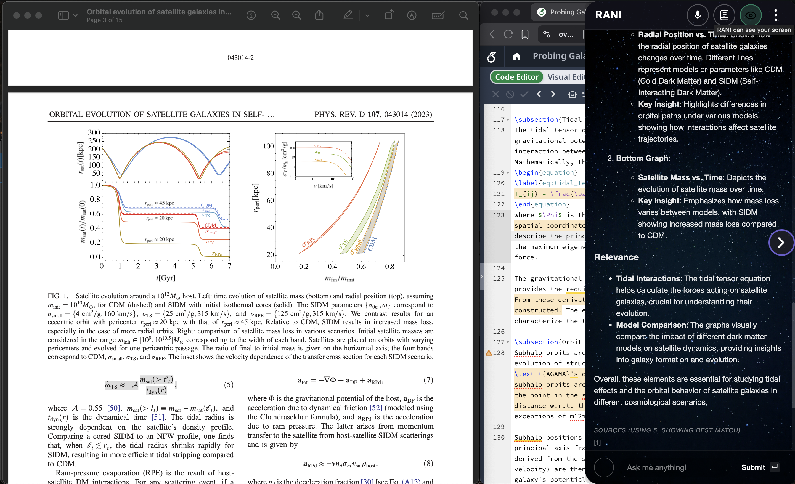
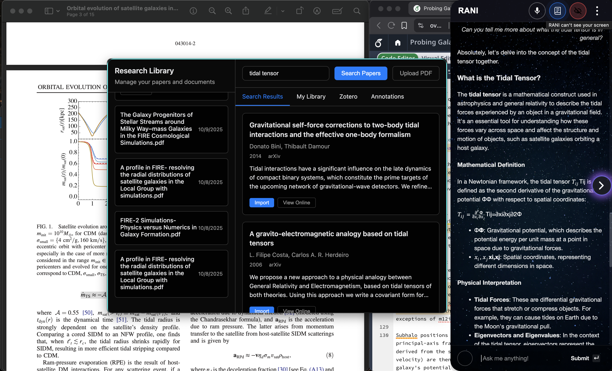

# Hero Carousel & Institutional Section Update

**Date:** November 5, 2025  
**Updates:** Image carousel for hero demo + minimalist institutional badges

---

## 🎠 Hero Demo Carousel

### Features Implemented:
1. **Automatic Image Cycling** - 5-second intervals
2. **Manual Controls** - Previous/Next arrow buttons
3. **Dot Navigation** - Click to jump to specific slides
4. **Pause on Hover** - Auto-play pauses when hovering
5. **Responsive Design** - Adapts to mobile screens
6. **Smooth Transitions** - 0.8s fade effect

### HTML Structure:
```html
<div class="hero-demo">
    <div class="hero-demo-carousel">
        
        
    </div>
    <div class="carousel-dots">
        <button class="carousel-dot active" data-slide="0"></button>
        <button class="carousel-dot" data-slide="1"></button>
    </div>
    <button class="carousel-arrow carousel-prev">...</button>
    <button class="carousel-arrow carousel-next">...</button>
</div>
```

### Adding More Images:
To add additional demo screenshots:

1. **Add image to assets folder:**
   ```
   website/assets/rani_demo_pic3.png
   ```

2. **Add img tag in HTML:**
   ```html
   <div class="hero-demo-carousel">
       
       
       
   </div>
   ```

3. **Add corresponding dot:**
   ```html
   <div class="carousel-dots">
       <button class="carousel-dot active" data-slide="0"></button>
       <button class="carousel-dot" data-slide="1"></button>
       <button class="carousel-dot" data-slide="2"></button>
   </div>
   ```

**That's it!** The JavaScript automatically detects all images and dots.

### JavaScript Functions:
- `initCarousel()` - Sets up all carousel functionality
- `showSlide(index)` - Displays specific slide
- `nextSlide()` / `prevSlide()` - Navigation
- `startAutoPlay()` / `stopAutoPlay()` - Timer control

### Carousel Behavior:
- **Auto-advance:** Every 5 seconds
- **Manual interaction:** Resets the 5-second timer
- **Hover:** Pauses auto-play
- **Leave:** Resumes auto-play
- **Keyboard:** Not implemented (could add arrow keys)

---

## 🏛️ Institutional Section Redesign

### Changes Made:
1. **Removed boxes** - No borders, backgrounds, or containers
2. **Updated heading** - "Trusted by **100,000+** individual researchers"
3. **Grayscale logos** - Subtle, professional appearance
4. **Hover effect** - Logo gains color on hover
5. **Larger spacing** - More breathing room
6. **Minimalist design** - Matches reference image

### Before:
```html
<div class="institutional-badge">
    
</div>
```
- White box with border
- 60px logo height
- Hover: border color change + lift

### After:
```html

```
- No container needed
- 48px logo height
- Grayscale + 70% opacity
- Hover: full color + 100% opacity

### CSS Changes:
```css
.institutional-logo {
    height: 48px;
    opacity: 0.7;
    filter: grayscale(100%);
}

.institutional-logo:hover {
    opacity: 1;
    filter: grayscale(0%);
}
```

### Adding More Institutions:
Simply add more `` tags:

```html
<div class="institutional-badges">
    
    
    
    
</div>
```

### Logo Requirements:
- **Format:** PNG with transparent background (preferred) or SVG
- **Height:** ~200-300px original (will scale to 48px)
- **Width:** Any (auto-scaled proportionally)
- **Color:** Full color (grayscale applied via CSS)
- **Background:** Transparent

---

## 📐 Size Improvements

### Hero Demo Container:
- **Before:** Max-width: 1200px (container default)
- **After:** Max-width: 1400px
- **Effect:** 16.7% larger display area
- **Spacing:** Maintained consistent margins

### Mobile Responsive:
- Carousel arrows: 40px (down from 48px)
- Carousel dots: Positioned closer to bottom
- Logo height: 48px on mobile (same as desktop for consistency)

---

## 🎨 Dark Mode Support

### Carousel in Dark Mode:
- Arrow buttons: Dark slate with light borders
- Arrow icons: Light indigo color
- Dots: Dark with light borders
- Active dot: Indigo fill

### Institutional Logos in Dark Mode:
- Base opacity: 50% (darker than light mode)
- Grayscale: 100% + brightness boost
- Hover: 80% opacity + color restoration
- Creates ghostly, elegant appearance

---

## ⚡ Performance Notes

### Image Loading:
All carousel images load immediately but only the first is visible. Consider lazy loading for many images:

```html

```

### CSS Animations:
- Hardware-accelerated (`opacity` transitions)
- Smooth 0.8s fade between slides
- No layout shifts or reflows

### JavaScript:
- Event listeners added once on load
- Interval cleared/reset on interaction
- No memory leaks (proper cleanup)

---

## 🎯 User Experience

### Carousel UX:
✅ **Visual indicators** - Dots show current slide and total count  
✅ **Manual control** - Users can navigate at their own pace  
✅ **Auto-advance** - Content cycles without interaction  
✅ **Pause on hover** - Users can examine details  
✅ **Smooth transitions** - Professional fade effect  
✅ **Mobile-friendly** - Touch targets meet accessibility guidelines (44x44px)

### Institutional UX:
✅ **Subtle branding** - Logos don't compete with content  
✅ **Hover interaction** - Rewards user attention  
✅ **Scalable** - Can add many institutions without clutter  
✅ **Professional** - Matches modern SaaS landing pages  
✅ **Accessible** - Alt text provided for screen readers

---

## 🔧 Troubleshooting

### Carousel Not Working:
1. Check browser console for JS errors
2. Verify all images exist in assets folder
3. Ensure matching number of images and dots
4. Hard refresh browser (Cmd+Shift+R)

### Images Not Cycling:
1. Check if `initCarousel()` is called
2. Verify `DOMContentLoaded` event fires
3. Check if auto-play interval is set (5000ms)

### Logos Still Have Boxes:
1. Hard refresh to clear CSS cache
2. Verify HTML doesn't have `<div class="institutional-badge">` wrapper
3. Check if old CSS is still being loaded

### Dark Mode Issues:
1. Toggle dark mode and hard refresh
2. Check if dark mode CSS rules are loading
3. Verify `.dark` class on `<body>` element

---

## 📊 Browser Compatibility

### Carousel:
- ✅ Chrome/Edge 90+
- ✅ Firefox 88+
- ✅ Safari 14+
- ✅ Mobile Safari (iOS 14+)
- ✅ Chrome Mobile (Android)

### CSS Filters (Grayscale):
- ✅ All modern browsers
- ⚠️ IE11 requires `-webkit-` prefix (not critical)

---

## 🚀 Future Enhancements

### Potential Additions:
- [ ] **Keyboard navigation** - Arrow keys to navigate slides
- [ ] **Swipe gestures** - Touch-based navigation on mobile
- [ ] **Slide captions** - Text overlay describing each demo
- [ ] **Progress bar** - Visual timer for auto-advance
- [ ] **Video support** - Play demo videos instead of images
- [ ] **Lazy loading** - Load images as they're needed
- [ ] **Preloading** - Preload next slide for instant transition

### Institutional Section Ideas:
- [ ] **Animated counter** - Count up to "100,000+"
- [ ] **Logo carousel** - Rotate through many institutions
- [ ] **Testimonial integration** - Click logo → show testimonial
- [ ] **Institution details** - Tooltip on hover with more info

---

## ✅ Testing Checklist

After deployment, verify:

- [ ] Carousel auto-advances every 5 seconds
- [ ] Clicking arrows changes slides immediately
- [ ] Clicking dots jumps to correct slide
- [ ] Hover pauses auto-play
- [ ] Leaving resumes auto-play
- [ ] Images transition smoothly (no flash)
- [ ] Arrows and dots visible and clickable
- [ ] Mobile: touch targets are 44x44px minimum
- [ ] Logos are grayscale by default
- [ ] Logos gain color on hover
- [ ] No white boxes around logos
- [ ] Dark mode: carousel controls visible
- [ ] Dark mode: logos appropriately styled
- [ ] Adding 3rd image: carousel works with 3 slides
- [ ] Responsive: looks good on mobile/tablet/desktop

---

**All changes deployed and ready!** 🎉
